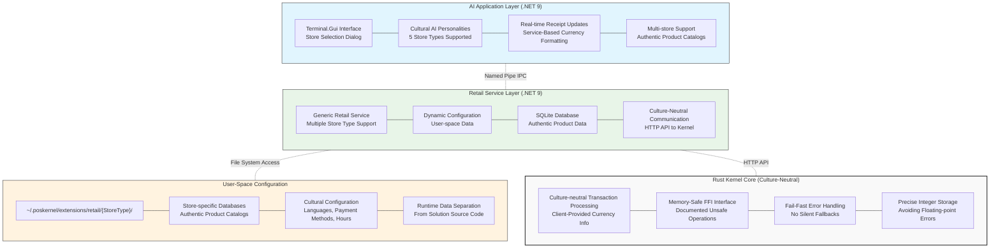
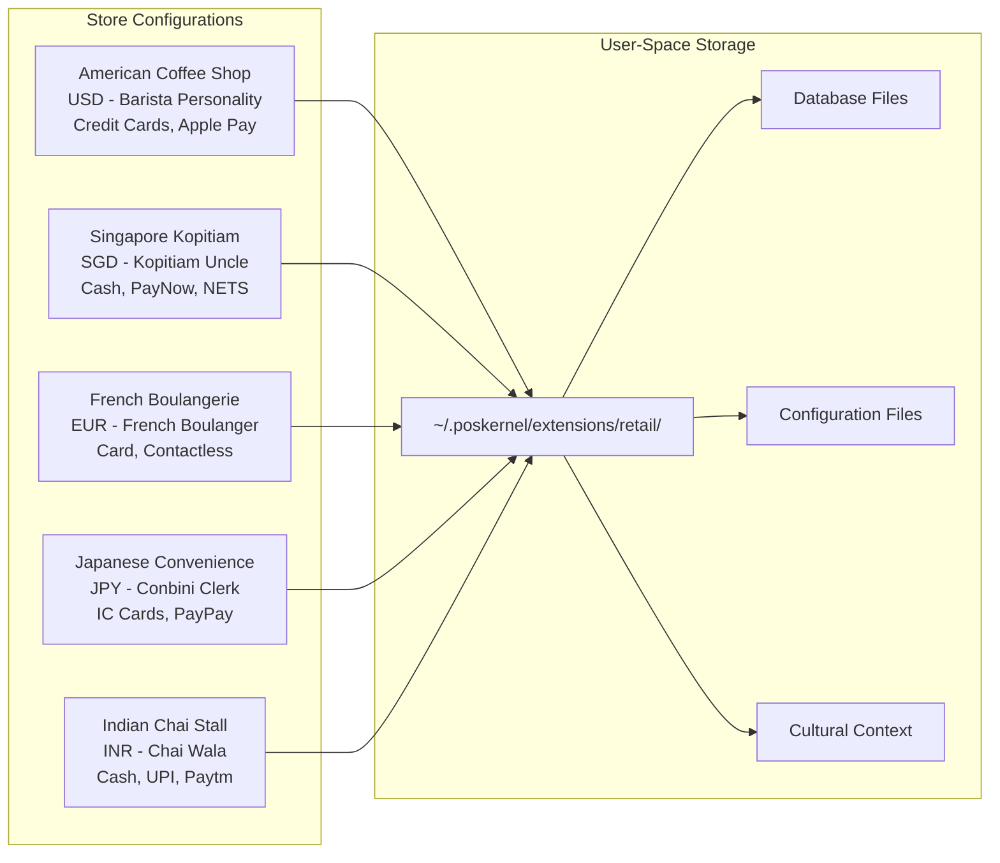
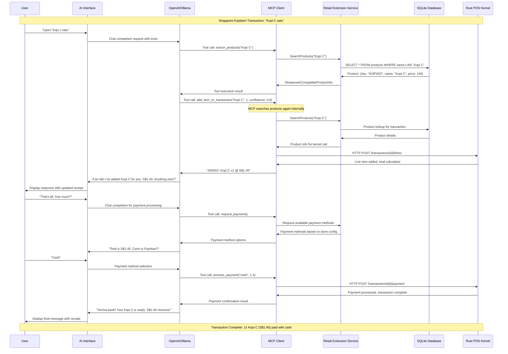
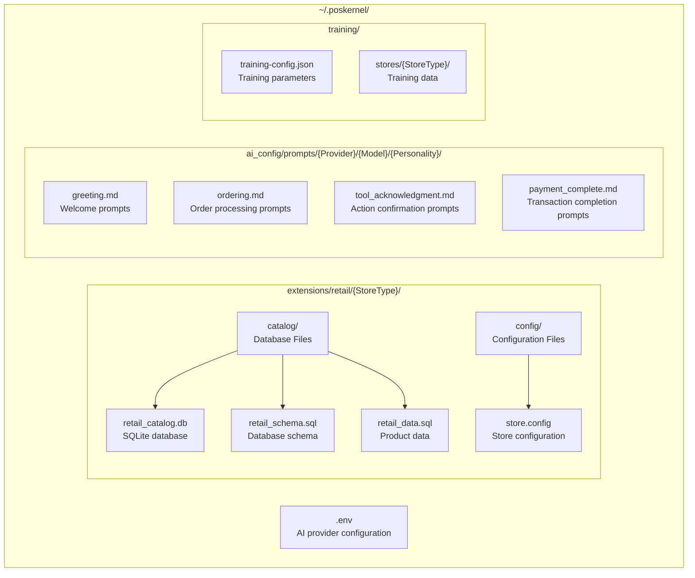
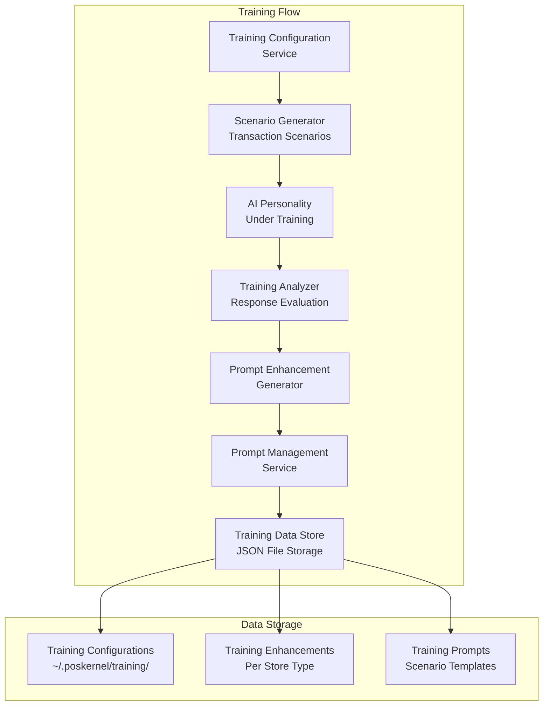

# POS Kernel

**A Rust point-of-sale transaction kernel with global extensibility and AI integration**

[](https://opensource.org/licenses/Apache-2.0)
[](#)
[](#)

## Overview

POS Kernel is an AI-enabled, culture-neutral transaction processing kernel designed for global deployment. The low-level point-of-sale kernel is built with Rust for security and performance, providing both HTTP service and FFI interfaces with comprehensive extension support for diverse retail environments.

The kernel provides a plug-in architecture for retail extensions, allowing easy addition of new store types with user-space data management. Currently, layers above the kernel are implemented in .NET 9 with C#, but any language should work here as well.

The AI integration enables culturally aware cashier personalities that understand local languages, currencies, and payment methods. The AI layer drives the point of sale through an MCP abstraction, allowing seamless switching between AI providers (e.g. OpenAI or Ollama). The AI layer communicates with the retail extension service via named pipes, while the retail extension service communicates with the Rust kernel via HTTP. This clean separation allows independent development and deployment of each layer.

Users may currently interact with the AI cashier via a terminal GUI application, but any client interface should be possible. A future goal is to add voice support.

## Demo Video
[](https://www.youtube.com/watch?v=OvtzOJsVfEg)

## Current Status: Production-Ready Architecture Complete

- **Culture-Neutral Kernel Architecture**: Zero hardcoded assumptions about currencies, languages, or payment methods
- **Memory-Safe FFI Interface**: All unsafe operations properly documented and secured  
- **Fail-Fast Error Handling**: Clear error messages when services are missing, no silent fallbacks
- **Extensible Retail Architecture**: Generic retail extension supporting multiple store types
- **User-Space Data Storage**: Runtime data isolated to `~/.poskernel` directory structure  
- **Multi-Cultural AI Integration**: Store-specific AI personalities with cultural intelligence
- **Comprehensive Store Support**: Five complete retail configurations with authentic products
- **Multi-Currency Operations**: Support for USD, SGD, EUR, JPY, INR with proper decimal handling
- **Real Database Integration**: SQLite databases with authentic product catalogs per store type
- **Service Architecture**: Named pipe IPC between AI demo and retail extension service
- **AI Training System**: Experimental framework for automatic prompt optimization

## Architecture Status

### Current v0.5.0 Stack (Production-Ready Architecture)



### Key Architectural Principles

The POS Kernel architecture is built on four core principles that ensure global deployability and maintainability:

#### 1. **Culture-Neutral Kernel**
The Rust kernel makes zero assumptions about:
- Currency symbols, decimal places, or formatting
- Language or locale-specific behavior  
- Payment methods or business rules
- Time formats or cultural time mappings

All cultural information is provided by user-space services and configuration.

#### 2. **Fail-Fast Error Handling**
The system never provides "helpful" defaults or silent fallbacks:
- Missing services cause immediate, clear error messages
- Configuration problems are surfaced immediately  
- No hardcoded assumptions that hide design deficiencies
- All error messages include architectural guidance for fixes

#### 3. **Memory-Safe FFI Interface**
All Rust-to-C# communication is secured:
- Comprehensive safety documentation for all unsafe operations
- Pointer validation and bounds checking
- Clear ownership and lifetime requirements
- No undefined behavior in the FFI boundary

#### 4. **Service-Based Architecture**
All formatting, validation, and business logic is handled by services:
- Currency formatting through `ICurrencyFormattingService`
- Time formatting through culture services
- Payment validation through store configuration
- No client-side business decisions

## Supported Store Types

The system includes five complete retail configurations with authentic products and cultural context:



### American Coffee Shop
- **Location**: `~/.poskernel/extensions/retail/CoffeeShop/`
- **Currency**: USD with 2 decimal places
- **Products**: Americano, Caffe Latte, Cappuccino, Blueberry Muffin, Breakfast Sandwich
- **AI Personality**: American Barista with coffee expertise
- **Payment Methods**: Credit cards, Apple Pay, Google Pay, cash

### Singapore Kopitiam
- **Location**: `~/.poskernel/extensions/retail/SingaporeKopitiam/`
- **Currency**: SGD with 2 decimal places
- **Products**: Kopi, Kopi C, Kopi O, Teh varieties, Kaya Toast, Half Boiled Eggs, local food
- **AI Personality**: Singaporean Kopitiam Uncle with Singlish expressions
- **Payment Methods**: Cash preferred, PayNow, NETS, GrabPay

### French Boulangerie
- **Location**: `~/.poskernel/extensions/retail/FrenchBoulangerie/`
- **Currency**: EUR with 2 decimal places
- **Products**: Croissant, Pain au Chocolat, Baguette, Éclair au Chocolat, traditional pastries
- **AI Personality**: French Boulanger emphasizing quality and craftsmanship
- **Payment Methods**: Card preferred, cash, contactless, chèque déjeuner

### Japanese Convenience Store
- **Location**: `~/.poskernel/extensions/retail/JapaneseConbini/`
- **Currency**: JPY with 0 decimal places
- **Products**: Onigiri, Karaage, Takoyaki, Kit Kat (Matcha), convenience items
- **AI Personality**: Japanese Convenience Store Clerk with efficient service
- **Payment Methods**: IC cards (Suica/Pasmo), PayPay, LINE Pay, cash

### Indian Chai Stall
- **Location**: `~/.poskernel/extensions/retail/IndianChaiStall/`
- **Currency**: INR with 2 decimal places
- **Products**: Masala Chai, Vada Pav, Samosa, Jalebi, Gulab Jamun, traditional sweets
- **AI Personality**: Indian Chai Wala with Hindi expressions and street-side atmosphere
- **Payment Methods**: Cash preferred, UPI, Paytm, PhonePe, GPay

## Transaction Flow Example

The following sequence diagram shows a complete transaction for ordering "Kopi C" at a Singapore kopitiam. The initial order is in Malay, and later interactions are in English. The AI cashier can adapt to both languages (as well as any others) and maintain the kopitiam personality throughout.



**Key architectural points:**
- **Culture-Neutral Kernel**: Rust kernel processes transaction without currency assumptions
- **Client-Provided Currency Info**: Decimal places and formatting rules from user-space
- **Memory-Safe FFI**: All kernel communication through documented safe interfaces
- **Service-Based Formatting**: Currency display handled by .NET services, not kernel
- **Fail-Fast Error Handling**: Missing services cause clear error messages
- **MCP Abstraction Layer**: Clean separation between business logic and AI provider specifics
- **Provider Independence**: Same MCP interface works with OpenAI, Ollama, or other providers

## Multi-Currency Architecture

The system properly handles diverse currency formats through a culture-neutral design:

```mermaid
graph TB
    subgraph "Client Layer (.NET)"
        A[User Request<br/>"Add $1.50 item"]
        A --> B[Currency Service<br/>USD: 2 decimals]
        B --> C[Convert to Minor Units<br/>$1.50 → 150 cents]
    end
    
    subgraph "Rust Kernel (Culture-Neutral)"
        C --> D[Store Transaction<br/>amount_minor: 150]
        D --> E[Calculate Totals<br/>Integer arithmetic]
        E --> F[Return Minor Units<br/>total_minor: 150]
    end
    
    subgraph "Display Layer (.NET)"
        F --> G[Currency Service<br/>USD: 2 decimals]
        G --> H[Convert to Major Units<br/>150 cents → $1.50]
        H --> I[Format for Display<br/>"Total: $1.50"]
    end
    
    style D fill:#f9f9f9,stroke:#333,stroke-width:2px
    style E fill:#f9f9f9,stroke:#333,stroke-width:2px
```

**Supported Currency Formats:**
- **USD/SGD/EUR**: 2 decimal places (S$1.20, €2.20)
- **JPY**: 0 decimal places (¥150)
- **INR**: 2 decimal places (₹20.00)

**Architecture Benefits:**
- **Kernel Neutrality**: Rust kernel never knows about currency symbols or decimal places
- **Client Responsibility**: All currency rules provided by user-space services
- **Precision**: Integer arithmetic in kernel avoids floating-point errors
- **Extensibility**: Easy addition of new currencies without kernel changes

## User-Space Data Architecture

Runtime data is stored separately from source code in the user's home directory:



## Setup Instructions

### Prerequisites

**Windows:**
- .NET 9 SDK
- Rust toolchain (`rustup` from https://rustup.rs/)
- Visual Studio 2022 or VS Code
- Git for Windows
- SQLite (optional, for manual database inspection)

**Linux:**
- .NET 9 SDK (`sudo apt install dotnet-sdk-9.0` on Ubuntu)
- Rust toolchain (`curl --proto '=https' --tlsv1.2 -sSf https://sh.rustup.rs | sh`)
- Git
- SQLite3 (`sudo apt install sqlite3`)

**macOS:**
- .NET 9 SDK (from Microsoft or via Homebrew)
- Rust toolchain (via rustup)
- Git (via Xcode Command Line Tools)
- SQLite3 (usually pre-installed)

### Initial Setup

1. **Clone the repository:**
   ```bash
   git clone https://github.com/paulmooreparks/PosKernel.git
   cd PosKernel
   ```

2. **Configure AI provider:**
   
   Create the configuration directory:
   ```bash
   # Windows (PowerShell)
   mkdir $env:USERPROFILE\.poskernel -Force
   
   # Linux/macOS
   mkdir -p ~/.poskernel
   ```
   
   Create `~/.poskernel/.env` with your AI provider settings:
   ```bash
   # For OpenAI (requires API key)
   STORE_AI_PROVIDER=OpenAI
   STORE_AI_MODEL=gpt-4o
   STORE_AI_BASE_URL=https://api.openai.com/v1
   OPENAI_API_KEY=your_api_key_here
   
   # For local Ollama (free, no API key required)
   # STORE_AI_PROVIDER=Ollama
   # STORE_AI_MODEL=llama3.1:8b
   # STORE_AI_BASE_URL=http://localhost:11434
   ```

3. **Build the solution:**
   ```bash
   # Build .NET projects
   dotnet build
   
   # Build Rust kernel
   cd pos-kernel-rs
   cargo build --release
   cd ..
   ```

### Running the Demo

**Full Demo with Complete Architecture:**

1. **Start the Rust POS kernel:**
   ```bash
   cd pos-kernel-rs
   cargo run --bin pos-kernel-service
   ```
   
   Keep this terminal open. The kernel will start on `http://localhost:8080`. You should see:
   ```
   🦀 POS Kernel Rust Service v0.4.0-minimal
   🚀 Starting HTTP API on http://127.0.0.1:8080
   ✅ Terminal RUST_SERVICE_01 initialized successfully
   ✅ Service ready at http://127.0.0.1:8080
   ```

2. **In a new terminal, start the retail extension service:**
   ```bash
   dotnet run --project PosKernel.Extensions.Restaurant
   ```
   
   Keep this terminal open. You should see output indicating the service started successfully and database creation.

3. **In a third terminal, start the AI demo:**
   ```bash
   dotnet run --project PosKernel.AI.Demo
   ```

4. **Use the store selection dialog** to choose from the five available store types.

5. **Interact with the AI** using natural language. Examples:
   - Singapore Kopitiam: "kopi c satu, roti kaya"
   - American Coffee Shop: "large latte with oat milk"
   - French Boulangerie: "croissant et café, s'il vous plaît"
   - Japanese Conbini: "salmon onigiri and green tea"
   - Indian Chai Stall: "masala chai aur samosa"

### Stopping Services

**Important**: The Rust service runs indefinitely and must be stopped manually:

- **Windows**: Use Task Manager to kill `pos-kernel-service.exe` or press Ctrl+C in the terminal
- **Linux/macOS**: Press Ctrl+C in the terminal running the Rust service

### Verifying Installation

1. **Check user-space data creation:**
   ```bash
   # Windows (PowerShell)
   ls $env:USERPROFILE\.poskernel\extensions\retail\
   
   # Linux/macOS
   ls ~/.poskernel/extensions/retail/
   ```
   
   You should see directories for: `CoffeeShop`, `FrenchBoulangerie`, `IndianChaiStall`, `JapaneseConbini`, `SingaporeKopitiam`

2. **Inspect database contents** (optional):
   ```bash
   # Windows (PowerShell)
   sqlite3 "$env:USERPROFILE\.poskernel\extensions\retail\SingaporeKopitiam\catalog\retail_catalog.db" "SELECT name, base_price_cents FROM products LIMIT 5;"
   
   # Linux/macOS
   sqlite3 ~/.poskernel/extensions/retail/SingaporeKopitiam/catalog/retail_catalog.db "SELECT name, base_price_cents FROM products LIMIT 5;"
   ```

3. **Test kernel API** (optional):
   ```bash
   curl http://localhost:8080/health
   curl http://localhost:8080/version
   ```

### Troubleshooting

**"Restaurant Extension Service not available" error:**
- Ensure the extension service is running: `dotnet run --project PosKernel.Extensions.Restaurant`
- Check that no firewall is blocking named pipe communication
- Try running in mock mode: `dotnet run --project PosKernel.AI.Demo --mock`

**"Failed to initialize terminal" error:**
- Ensure the Rust kernel service is running: `cargo run --bin pos-kernel-service`
- Check that port 8080 is not in use by another application
- Verify Rust toolchain is properly installed: `cargo --version`

**AI provider errors:**
- Verify your `~/.poskernel/.env` file exists and contains valid configuration
- For OpenAI: Check your API key is valid and has credits
- For Ollama: Ensure Ollama is running locally with the specified model

**Database not found errors:**
- The extension service creates databases automatically on first run
- Check that the user has write permissions to their home directory
- Verify the extension service completed initialization before starting the demo

**Build errors:**
- Ensure .NET 9 SDK is installed: `dotnet --version`
- Ensure Rust is installed: `rustc --version`
- Try a clean build: `dotnet clean && dotnet build`

## Architecture Goals

### Culture Neutrality
- **No hardcoded currency assumptions**: All formatting handled by services
- **No language assumptions**: Multi-language support through configuration
- **No payment method assumptions**: Store-specific payment method configuration
- **No time format assumptions**: Culture services handle all time formatting

### Fail-Fast Design  
- **No silent fallbacks**: Missing services cause clear error messages
- **Configuration validation**: All required services must be properly registered
- **Design deficiency detection**: Clear indication when architectural boundaries are crossed
- **Architectural guidance**: Error messages include instructions for proper fixes

### Memory Safety
- **Documented unsafe operations**: All FFI code requires comprehensive safety documentation
- **Pointer validation**: All memory access is bounds-checked and validated
- **Clear ownership**: Explicit ownership and lifetime requirements for all data
- **No undefined behavior**: Strict adherence to Rust safety guarantees

### Extensibility
- **Generic retail framework**: Easy addition of new store types
- **User-space configuration**: Runtime data separated from source code
- **Service-oriented architecture**: Clean separation between AI, extensions, and kernel
- **Provider independence**: Pluggable AI providers through MCP abstraction

## Development

### Project Structure

**Core Components:**
- `pos-kernel-rs/` - Rust kernel HTTP service
- `PosKernel.AI/` - Core AI integration services  
- `PosKernel.AI.Demo/` - Terminal.Gui demonstration application

**Extensions & Services:**
- `PosKernel.Extensions.Restaurant/` - Generic retail extension service
- `PosKernel.Configuration/` - Configuration management
- `PosKernel.Client/` - Kernel client libraries

**Training System:**
- `PosKernel.AI.Training/` - Core training framework and services
- `PosKernel.AI.Training.TUI/` - Terminal-based training interface
- `PosKernel.AI.Training.Test/` - Training system validation and testing

**Documentation:**
- `docs/` - Architecture documentation and design principles

### Key Technologies
- **Rust**: Culture-neutral transaction kernel with memory safety
- **.NET 9**: AI integration and demo applications
- **Terminal.Gui**: Cross-platform terminal user interface
- **SQLite**: Product catalog databases with authentic regional data
- **OpenAI/Ollama**: Large language model integration for AI personalities
- **Named Pipes**: IPC between demo application and extension service
- **HTTP**: Communication between extension service and Rust kernel

### Adding New Store Types

1. Create directory: `~/.poskernel/extensions/retail/{NewStoreType}/`
2. Add database files: `catalog/retail_schema.sql`, `catalog/retail_data.sql`
3. Add configuration: `config/store.config`
4. Update `RetailExtensionService` configuration to include the new store type
5. Add AI prompts for the new personality type
6. Test with both OpenAI and Ollama providers

### Contributing

When contributing to POS Kernel:

1. **Follow architectural principles**: No hardcoded assumptions, fail-fast error handling
2. **Document unsafe operations**: All FFI code requires comprehensive safety documentation
3. **Test with multiple currencies**: Verify zero decimal (JPY) and 3 decimal (BHD) currencies
4. **Validate cultural neutrality**: Code should work in any locale without modification
5. **Include proper error messages**: Use "DESIGN DEFICIENCY" pattern for architectural violations

## AI Training System

The system includes an experimental AI training framework designed to automatically improve cashier personalities through simulated customer interactions. This system demonstrates the potential for continuous learning and improvement of AI personalities.

### Training Architecture



### Training Components

Training is configured per store type with cultural context:

- **PosKernel.AI.Training**: Core training framework and services
- **PosKernel.AI.Training.TUI**: Terminal-based training interface for monitoring sessions
- **PosKernel.AI.Training.Test**: Training system validation and testing

### Current Status

The training system is **experimental** and includes:

- ✅ **Training Framework**: Complete service architecture for automated training
- ✅ **Scenario Generation**: Configurable customer interaction scenarios
- ✅ **Multi-Store Support**: Training configurations for each retail store type
- ✅ **Response Analysis**: Automated evaluation of AI responses
- ✅ **Culture-Neutral Design**: No hardcoded assumptions in training system
- 🚧 **Enhancement Application**: Automatic prompt improvement (in development)
- 🚧 **Feedback Loops**: Continuous learning from training results (planned)

### Usage

Training sessions can be initiated through the training TUI:

```bash
dotnet run --project PosKernel.AI.Training.TUI
```

The system will:
1. Load training configurations for available store types
2. Generate customer interaction scenarios
3. Run AI personalities through training scenarios
4. Analyze responses and generate enhancement suggestions
5. Store training results for future prompt improvements

### Training Data Location

Training data is stored in user-space:

**Global Training Settings:**
- `~/.poskernel/training/training-config.json` - Global training configuration
- `~/.poskernel/training/training-prompt.md` - Base training scenario template

**Store-Specific Training Data:**
- `~/.poskernel/training/stores/{StoreType}/training-enhancements.md` - Store-specific improvements and customizations

