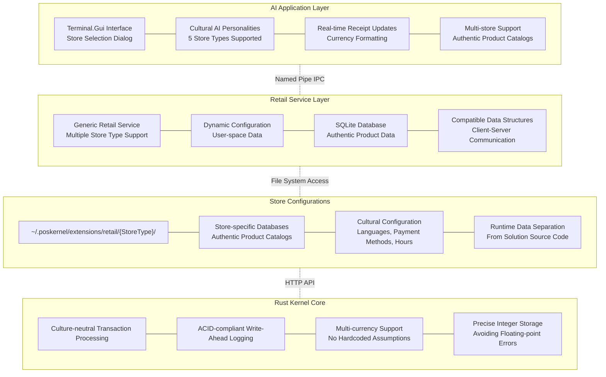
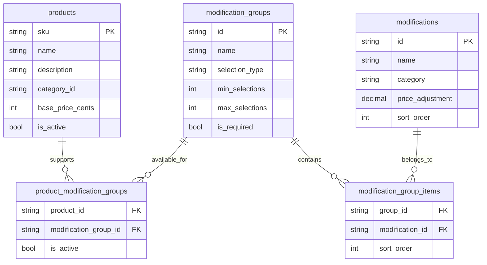
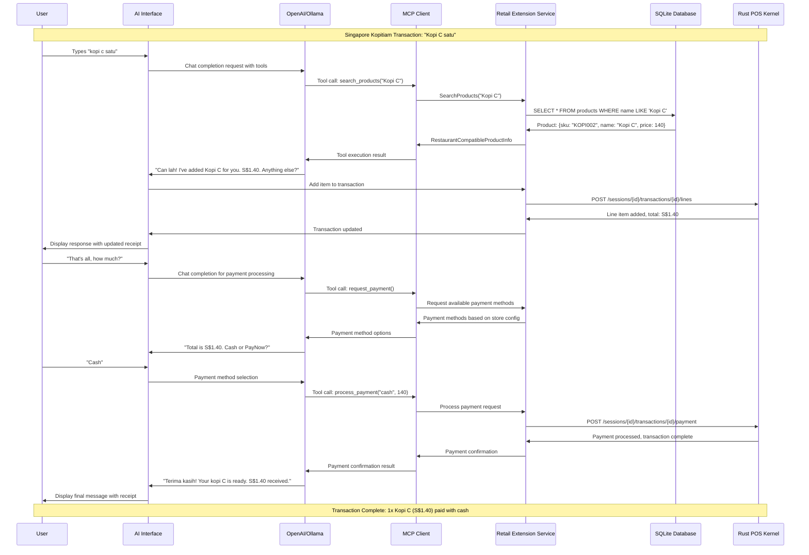
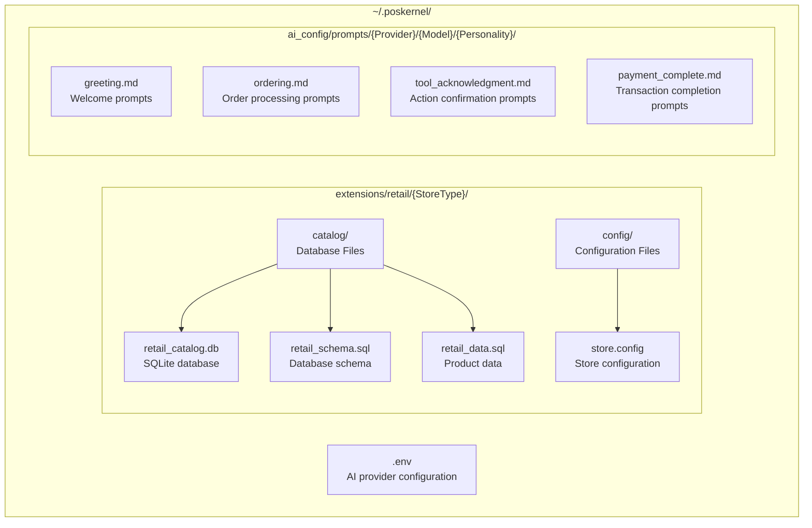

# POS Kernel

**A Rust point-of-sale transaction kernel with global extensibility and AI integration**

[](https://opensource.org/licenses/Apache-2.0)
[](#)
[](#)

## Overview

POS Kernel is an AI-enabled, culture-neutral transaction processing kernel designed for global deployment. The low-level point-of-sale kernel is built with Rust for security and performance, providing both HTTP service and FFI interfaces with an comprehensive extension support for diverse retail environments.

The kernel provides a plug-in architecture for retail extensions, allowing easy addition of new store types with user-space data management. Currently, layers above the kernel are implemented in .NET 9 with C#, but any language should work here as well.

The AI integration enables culturally aware cashier personalities that understand local languages, currencies, and payment methods. The AI layer drives the point of sale through an MCP abstraction, allowing seamless switching between AI providers (e.g. OpenAI or Ollama). The AI layer communicates with the retail extension service via named pipes, while the retail extension service communicates with the Rust kernel via HTTP. This clean separation allows independent development and deployment of each layer.

Users may currently interact with the AI cashier via a terminal GUI application, but any client interface should be possible. A future goal is to add voice support.

## Demo Video
[](https://www.youtube.com/watch?v=OvtzOJsVfEg)

## Current Status: Extensible Retail Architecture POC Complete

- **Extensible Retail Architecture**: Generic retail extension supporting multiple store types
- **User-Space Data Storage**: Runtime data isolated to `~/.poskernel` directory structure  
- **Multi-Cultural AI Integration**: Store-specific AI personalities with cultural intelligence
- **Comprehensive Store Support**: Five complete retail configurations with authentic products
- **Multi-Currency Operations**: Support for USD, SGD, EUR, JPY, INR with proper decimal handling
- **Real Database Integration**: SQLite databases with authentic product catalogs per store type
- **Service Architecture**: Named pipe IPC between AI demo and retail extension service

## Architecture Status

### Current v0.5.0 Stack (Extensible Architecture Complete)



## Supported Store Types

The system includes five complete retail configurations with authentic products and cultural context:


### American Coffee Shop
- **Location**: `~/.poskernel/extensions/retail/CoffeeShop/`
- **Currency**: USD with standard coffee shop pricing
- **Products**: Americano, Caffe Latte, Cappuccino, Blueberry Muffin, Breakfast Sandwich
- **AI Personality**: American Barista with coffee expertise
- **Payment Methods**: Credit cards, Apple Pay, Google Pay, cash

### Singapore Kopitiam
- **Location**: `~/.poskernel/extensions/retail/SingaporeKopitiam/`
- **Currency**: SGD with traditional kopitiam pricing
- **Products**: Kopi, Kopi C, Kopi O, Teh varieties, Kaya Toast, Half Boiled Eggs, local food
- **AI Personality**: Singaporean Kopitiam Uncle with Singlish expressions
- **Payment Methods**: Cash preferred, PayNow, NETS, GrabPay

### French Boulangerie
- **Location**: `~/.poskernel/extensions/retail/FrenchBoulangerie/`
- **Currency**: EUR with artisanal bakery pricing
- **Products**: Croissant, Pain au Chocolat, Baguette, Éclair au Chocolat, traditional pastries
- **AI Personality**: French Boulanger emphasizing quality and craftsmanship
- **Payment Methods**: Card preferred, cash, contactless, chèque déjeuner

### Japanese Convenience Store
- **Location**: `~/.poskernel/extensions/retail/JapaneseConbini/`
- **Currency**: JPY with no decimal places
- **Products**: Onigiri, Karaage, Takoyaki, Kit Kat (Matcha), convenience items
- **AI Personality**: Japanese Convenience Store Clerk with efficient service
- **Payment Methods**: IC cards (Suica/Pasmo), PayPay, LINE Pay, cash

### Indian Chai Stall
- **Location**: `~/.poskernel/extensions/retail/IndianChaiStall/`
- **Currency**: INR with street food pricing
- **Products**: Masala Chai, Vada Pav, Samosa, Jalebi, Gulab Jamun, traditional sweets
- **AI Personality**: Indian Chai Wala with Hindi expressions and street-side atmosphere
- **Payment Methods**: Cash preferred, UPI, Paytm, PhonePe, GPay

## Product Modification Framework

The system supports complex product customizations through a flexible modification framework, demonstrated in the American Coffee Shop configuration:



**Example**: A Latte supports modification groups like:
- **Size Options**: Tall (-$0.30), Grande (base), Venti (+$0.65)
- **Milk Options**: 2% (free), Oat Milk (+$0.65), Almond Milk (+$0.65)
- **Syrup Options**: Vanilla (+$0.65), Caramel (+$0.65), multiple selections allowed
- **Shot Options**: Extra Shot (+$0.75), Decaf (free), Ristretto (free)

This framework enables culturally appropriate customizations. For example, the Singapore Kopitiam uses similar patterns for traditional modifications like "gao" (extra strong) or "kosong" (no sugar).

## Transaction Flow Example

The following sequence diagram shows a complete transaction for ordering "Kopi C" at a Singapore kopitiam. The initial order is in Malay, and later interactions are in English. The AI cashier can adapt to both languages (as well as any others) and maintain the kopitiam personality throughout.



**Key architectural points:**
- **MCP Abstraction Layer**: Clean separation between business logic and AI provider specifics
- **Cultural Intelligence**: AI understands "kopi c satu" (one Kopi C in Singlish) via MCP
- **Provider Independence**: Same MCP interface works with OpenAI, Ollama, or other providers
- **Tool/Function Calling**: MCP handles translation between business tools and AI provider formats
- **User-Space Data**: Product lookup from Singapore kopitiam database
- **Currency Handling**: Proper SGD formatting without hardcoded assumptions
- **Payment Methods**: Store-specific payment options (cash, PayNow, NETS)
- **AI Personality**: Kopitiam uncle responses ("Can lah!", "Terima kasih!") through MCP context
- **Transaction Storage**: Rust kernel provides persistent transaction storage and ACID compliance

## Multi-Currency Architecture

The system properly handles diverse currency formats without hardcoded assumptions:

- **USD/SGD/EUR**: 2 decimal places (S$1.20, €2.20)
- **JPY**: 0 decimal places (¥150)
- **INR**: 2 decimal places (₹20.00)

All currency formatting is handled by services, not hardcoded in the kernel or clients.

## User-Space Data Architecture

Runtime data is stored separately from source code in the user's home directory:



## Setup Instructions

### Prerequisites

**Windows:**
- .NET 9 SDK
- Visual Studio 2022 or VS Code
- Git for Windows
- SQLite (optional, for manual database inspection)

**Linux:**
- .NET 9 SDK (`sudo apt install dotnet-sdk-9.0` on Ubuntu)
- Git
- SQLite3 (`sudo apt install sqlite3`)

**macOS:**
- Theoretically supported but as-yet untested. Steps should be similar to Linux.

### Initial Setup

1. **Clone the repository:**
   ```bash
   git clone https://github.com/paulmooreparks/PosKernel.git
   cd PosKernel
   ```

2. **Configure AI provider:**
   
   Create the configuration directory:
   ```bash
   # Windows (PowerShell)
   mkdir $env:USERPROFILE\.poskernel -Force
   
   # Linux/macOS
   mkdir -p ~/.poskernel
   ```
   
   Create `~/.poskernel/.env` with your AI provider settings:
   ```bash
   # For OpenAI (requires API key)
   STORE_AI_PROVIDER=OpenAI
   STORE_AI_MODEL=gpt-4o
   STORE_AI_BASE_URL=https://api.openai.com/v1
   OPENAI_API_KEY=your_api_key_here
   
   # For local Ollama (free, no API key required)
   # STORE_AI_PROVIDER=Ollama
   # STORE_AI_MODEL=llama3.1:8b
   # STORE_AI_BASE_URL=http://localhost:11434
   ```

3. **Build the solution:**
   ```bash
   dotnet build
   ```

### Running the Demo

**Prerequisites for Full Integration:**
- Rust toolchain installed (`rustup` from https://rustup.rs/)
- All .NET prerequisites from above

**Full Demo with Complete Architecture:**

1. **Start the Rust POS kernel:**
   ```bash
   cd pos-kernel-rs
   cargo run --bin pos-kernel-service
   ```
   
   Keep this terminal open. The kernel will start on `http://localhost:8080`. You should see output indicating the service started successfully.

2. **In a new terminal, start the retail extension service:**
   ```bash
   dotnet run --project PosKernel.Extensions.Restaurant
   ```
   
   Keep this terminal open. You should see output indicating the service started successfully and database creation.

3. **In a third terminal, start the AI demo:**
   ```bash
   dotnet run --project PosKernel.AI.Demo
   ```

4. **Use the store selection dialog** to choose from the five available store types.

5. **Interact with the AI** using natural language. Examples:
   - Singapore Kopitiam: "kopi c satu, roti kaya"
   - American Coffee Shop: "large latte with oat milk"
   - French Boulangerie: "croissant et café, s'il vous plaît"
   - Japanese Conbini: "salmon onigiri and green tea"
   - Indian Chai Stall: "masala chai aur samosa"

**Development Mode (Limited Integration):**

If you need to test without the full architecture stack:
```bash
dotnet run --project PosKernel.AI.Demo --mock
```

**Note**: Development mode uses mock data and bypasses both the Rust kernel and retail extension service. This is only for development testing and does not demonstrate the complete architectural integration.

### Verifying Installation

1. **Check user-space data creation:**
   ```bash
   # Windows (PowerShell)
   ls $env:USERPROFILE\.poskernel\extensions\retail\
   
   # Linux/macOS
   ls ~/.poskernel/extensions/retail/
   ```
   
   You should see directories for: `CoffeeShop`, `FrenchBoulangerie`, `IndianChaiStall`, `JapaneseConbini`, `SingaporeKopitiam`

2. **Inspect database contents** (optional):
   ```bash
   # Windows (PowerShell)
   sqlite3 "$env:USERPROFILE\.poskernel\extensions\retail\SingaporeKopitiam\catalog\retail_catalog.db" "SELECT name, base_price_cents FROM products LIMIT 5;"
   
   # Linux/macOS
   sqlite3 ~/.poskernel/extensions/retail/SingaporeKopitiam/catalog/retail_catalog.db "SELECT name, base_price_cents FROM products LIMIT 5;"
   ```

3. **Test store switching** by running the demo multiple times and selecting different store types to verify distinct product catalogs and AI personalities.

### Troubleshooting

**"Restaurant Extension Service not available" error:**
- Ensure the extension service is running: `dotnet run --project PosKernel.Extensions.Restaurant`
- Check that no firewall is blocking named pipe communication
- Try running in mock mode: `dotnet run --project PosKernel.AI.Demo --mock`

**AI provider errors:**
- Verify your `~/.poskernel/.env` file exists and contains valid configuration
- For OpenAI: Check your API key is valid and has credits
- For Ollama: Ensure Ollama is running locally with the specified model

**Database not found errors:**
- The extension service creates databases automatically on first run
- Check that the user has write permissions to their home directory
- Verify the extension service completed initialization before starting the demo

## Architecture Goals

### Culture Neutrality
- **No hardcoded currency assumptions**: All formatting handled by services
- **No language assumptions**: Multi-language support through configuration
- **No payment method assumptions**: Store-specific payment method configuration

### Fail-Fast Design  
- **No silent fallbacks**: Missing services cause clear error messages
- **Configuration validation**: All required services must be properly registered
- **Design deficiency detection**: Clear indication when architectural boundaries are crossed

### Extensibility
- **Generic retail framework**: Easy addition of new store types
- **User-space configuration**: Runtime data separated from source code
- **Service-oriented architecture**: Clean separation between AI, extensions, and kernel

## Development

### Project Structure

**Core Components:**
- `pos-kernel-rs/` - Rust kernel HTTP service
- `PosKernel.AI/` - Core AI integration services  
- `PosKernel.AI.Demo/` - Terminal.Gui demonstration application

**Extensions & Services:**
- `PosKernel.Extensions.Restaurant/` - Generic retail extension service
- `PosKernel.Configuration/` - Configuration management
- `PosKernel.Client/` - Kernel client libraries

**Training System:**
- `PosKernel.AI.Training/` - Core training framework and services
- `PosKernel.AI.Training.TUI/` - Terminal-based training interface
- `PosKernel.AI.Training.Test/` - Training system validation and testing

**Documentation:**
- `docs/` - Architecture documentation

### Key Technologies
- **.NET 9**: AI integration and demo applications
- **Terminal.Gui**: Cross-platform terminal user interface
- **SQLite**: Product catalog databases with authentic regional data
- **OpenAI/Ollama**: Large language model integration for AI personalities
- **Named Pipes**: IPC between demo application and extension service

### Adding New Store Types

1. Create directory: `~/.poskernel/extensions/retail/{NewStoreType}/`
2. Add database files: `catalog/retail_schema.sql`, `catalog/retail_data.sql`
3. Add configuration: `config/store.config`
4. Update `RetailExtensionService` configuration to include the new store type
5. Add AI prompts for the new personality type

## AI Training System

The system includes an experimental AI training framework designed to automatically improve cashier personalities through simulated customer interactions. This system is in early development stages but demonstrates the potential for continuous learning and improvement of AI personalities.

### Training Architecture


### How Training Works

The training system operates by:

1. **Scenario Generation**: Creates realistic customer interaction scenarios for specific store types
2. **AI Response Collection**: Runs the AI personality through these scenarios and captures responses
3. **Response Analysis**: Evaluates AI responses for appropriateness, cultural accuracy, and helpfulness
4. **Enhancement Generation**: Uses the analysis to generate specific improvements to prompts
5. **Prompt Refinement**: Updates the AI personality prompts based on training results

### Training Components

Training is configured per store type with cultural context:

- **PosKernel.AI.Training**: Core training framework and services
- **PosKernel.AI.Training.TUI**: Terminal-based training interface for monitoring sessions
- **PosKernel.AI.Training.Test**: Training system validation and testing

### Current Status

The training system is **experimental** and includes:

- ✅ **Training Framework**: Complete service architecture for automated training
- ✅ **Scenario Generation**: Configurable customer interaction scenarios
- ✅ **Multi-Store Support**: Training configurations for each retail store type
- ✅ **Response Analysis**: Automated evaluation of AI responses
- 🚧 **Enhancement Application**: Automatic prompt improvement (in development)
- 🚧 **Feedback Loops**: Continuous learning from training results (planned)

### Usage

Training sessions can be initiated through the training TUI:

```bash
dotnet run --project PosKernel.AI.Training.TUI
```

The system will:
1. Load training configurations for available store types
2. Generate customer interaction scenarios
3. Run AI personalities through training scenarios
4. Analyze responses and generate enhancement suggestions
5. Store training results for future prompt improvements

### Training Data Location

Training data is stored in user-space:

**Global Training Settings:**
- `~/.poskernel/training/training-config.json` - Global training configuration
- `~/.poskernel/training/training-prompt.md` - Base training scenario template

**Store-Specific Training Data:**
- `~/.poskernel/training/stores/{StoreType}/training-enhancements.md` - Store-specific improvements and customizations

