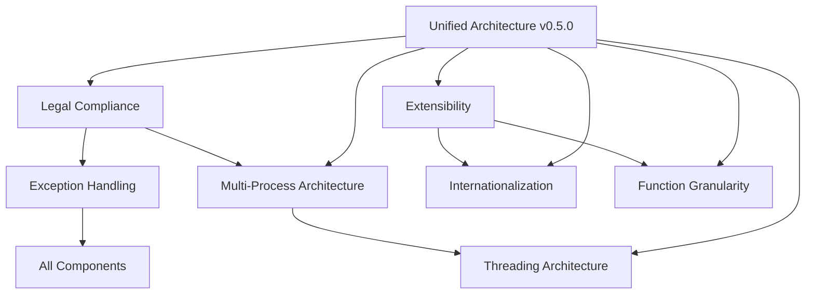

# POS Kernel Architecture Harmonization & Implementation Plan

**Analysis Date**: January 2025  
**System**: POS Kernel v0.4.0-threading → v0.5.0-extensible  
**Scope**: Cross-functional architecture harmonization and next implementation phase  

## Architecture Synergy Analysis

### Unified Design Themes

All design documents converge on several key themes:

1. **Security-First Design**: OS-inspired security model throughout
2. **Abstraction Layers**: Clean separation between kernel and customization
3. **Global Readiness**: Culture-neutral kernel with localized user-space
4. **Compliance by Design**: Legal requirements baked into architecture
5. **Extensibility**: Plugin-based customization without kernel modification
6. **Performance**: Multi-process isolation with efficient FFI

### Cross-Document Dependencies



## Harmonization Findings

### 1. Security Model Alignment

**Convergence**: All documents support OS-inspired security:
- **Legal Compliance**: ACID logging with tamper evidence
- **Extensibility**: Code-signed plugins with capability-based security  
- **Multi-Process**: Process isolation for fault tolerance
- **Exception Handling**: Fail-fast with comprehensive audit trails

**Unified Security Architecture**:
```rust
// Unified security model across all components
pub struct UnifiedSecurityContext {
    // Legal compliance (from legal-compliance.md)
    audit_logger: Arc<TamperProofLogger>,
    wal_integrity: WalIntegrityChecker,
    
    // Plugin security (from extensibility-architecture.md)  
    plugin_validator: PluginSecurityManager,
    capability_enforcer: CapabilityEnforcer,
    
    // Process security (from multi-process-architecture.md)
    process_isolator: ProcessIsolationManager,
    resource_limiter: ResourceLimiter,
    
    // Exception security (from exception-handling-report.md)
    error_classifier: ErrorClassifier,
    secure_logger: SecureAuditLogger,
}
```

### 2. Extension Point Consolidation

**Duplication Found**: Multiple documents define similar extension interfaces:

**Before (Duplicated)**:
- **Extensibility**: `CustomizationAbstractionLayer` 
- **Internationalization**: `ILocalizationService`
- **Function Granularity**: Provider pattern suggestions

**After (Harmonized)**:
```rust
// Unified extension system
pub trait PosExtensionLayer {
    // Customization (CAL)
    fn get_customization_layer(&self) -> Box<dyn CustomizationAbstractionLayer>;
    
    // Localization 
    fn get_localization_service(&self) -> Box<dyn LocalizationService>;
    
    // Business logic extensions
    fn get_business_providers(&self) -> BusinessProviderRegistry;
}

// Hierarchical extension loading
pub struct ExtensionHierarchy {
    // Core kernel extensions (signed, high trust)
    kernel_extensions: Vec<Box<dyn KernelExtension>>,
    
    // Regional extensions (vendor signed)
    regional_extensions: HashMap<String, Box<dyn RegionalExtension>>,
    
    // Business extensions (enterprise or user signed)
    business_extensions: Vec<Box<dyn BusinessExtension>>,
}
```

### 3. FFI Function Organization

**Convergence**: All documents point to expanded FFI surface:

**Current**: 13 basic functions (v0.4.0)  
**Required**: ~60 comprehensive functions (v0.5.0)

**Unified FFI Categories**:
```rust
// Organized by functional area with consistent patterns
pub mod ffi {
    // Core transaction management (legal-compliance.md)
    pub mod transaction;
    
    // Line item operations (function-granularity.md)
    pub mod line_items;
    
    // Payment processing (function-granularity.md)  
    pub mod payments;
    
    // Extension registration (extensibility-architecture.md)
    pub mod extensions;
    
    // Localization hooks (internationalization-strategy.md)
    pub mod localization;
    
    // Process coordination (multi-process-architecture.md)
    pub mod coordination;
    
    // Security and audit (exception-handling.md + legal-compliance.md)
    pub mod security;
}
```

### 4. Configuration System Unification

**Convergence**: Multiple docs describe configuration needs:

**Unified Configuration Hierarchy**:
```rust
pub struct UnifiedConfiguration {
    // Global system configuration
    global: GlobalConfig,
    
    // Regional/jurisdictional (internationalization + extensibility)
    regional: HashMap<String, RegionalConfig>,
    
    // Store-specific (multi-process + legal-compliance)
    store: HashMap<String, StoreConfig>,
    
    // Terminal-specific (multi-process-architecture.md)
    terminal: HashMap<String, TerminalConfig>,
    
    // Extension configuration (extensibility-architecture.md)
    extensions: ExtensionConfigRegistry,
}

// Configuration resolution with proper precedence
impl UnifiedConfiguration {
    pub fn resolve(&self, context: &ConfigurationContext) -> EffectiveConfig {
        // Terminal > Store > Regional > Global precedence
        // Extensions can override/extend at any level
    }
}
```

## Harmonized Architecture v0.5.0

### Unified Component Stack

```
┌─────────────────────────────────────────────────────────────────┐
│                     Application Layer                           │
│  • Business Logic (localized)    • UI/UX (culture-specific)    │
│  • Workflow Adaptation          • Device Integration           │
└─────────────────────────────────────────────────────────────────┘
                                  ↓
┌─────────────────────────────────────────────────────────────────┐
│                  Extension Ecosystem                            │
│  • Signed Plugins               • Regional Providers           │
│  • Capability-Based Security   • Customization Abstraction    │
│  • Localization Services       • Business Rule Engines        │
└─────────────────────────────────────────────────────────────────┘
                                  ↓
┌─────────────────────────────────────────────────────────────────┐
│                   Enhanced FFI Layer                            │
│  • ~60 Functions                • Handle-Based Design          │
│  • Extension Hooks             • Security Validation          │
│  • Batch Operations            • Performance Optimization     │
└─────────────────────────────────────────────────────────────────┘
                                  ↓
┌─────────────────────────────────────────────────────────────────┐
│                    Rust Kernel Core                             │
│  • ACID Transactions           • Multi-Process Isolation       │
│  • Exception Safety            • Tamper-Proof Logging          │
│  • Performance Optimized       • Culture-Neutral Design        │
└─────────────────────────────────────────────────────────────────┘
```

### Key Architectural Principles (Harmonized)

1. **Security Throughout**: Every layer implements security controls
2. **Culture Neutrality**: Kernel never handles localized content
3. **Legal by Design**: All operations logged for compliance
4. **Extensible by Default**: Plugin points at every abstraction level
5. **Performance First**: Multi-process + efficient FFI + batch operations
6. **Fail-Safe**: Exception handling prevents data corruption

## Implementation Plan v0.5.0-extensible

### Phase 1: Core Extension Framework (Weeks 1-3)

**Priority**: Foundation for all other features

**Deliverables**:
```rust
// 1. Unified extension system
pub trait PosExtension {
    fn metadata(&self) -> ExtensionMetadata;
    fn initialize(&mut self, context: &ExtensionContext) -> Result<(), ExtensionError>;
    fn capabilities(&self) -> ExtensionCapabilities;
}

// 2. Security framework  
pub struct ExtensionSecurityManager {
    signature_validator: CodeSignatureValidator,
    capability_enforcer: CapabilityEnforcer,
    sandbox_manager: SandboxManager,
}

// 3. Enhanced FFI foundation
// Add ~20 new functions focusing on extension registration
#[no_mangle] pub extern "C" fn pk_register_extension(...) -> PkResult;
#[no_mangle] pub extern "C" fn pk_load_regional_config(...) -> PkResult;
#[no_mangle] pub extern "C" fn pk_validate_extension_signature(...) -> PkResult;
```

**Integration Points**:
- Build on current legal compliance (ACID logging)
- Extend current multi-process architecture
- Maintain current exception handling patterns

### Phase 2: Enhanced Transaction Management (Weeks 4-6)

**Priority**: Core business functionality expansion

**Deliverables**:
```rust
// 1. Enhanced transaction model (from function-granularity.md)
struct EnhancedTransaction {
    lines: HashMap<u64, LineItem>,           // Line ID tracking
    tenders: HashMap<u64, Tender>,           // Multiple payment types
    promotions: Vec<AppliedPromotion>,       // Discount tracking
    tax_info: TaxCalculation,                // Tax details
    audit_trail: Vec<AuditEvent>,            // Enhanced auditing
}

// 2. New FFI functions (~25 functions)
#[no_mangle] pub extern "C" fn pk_update_line_quantity(...) -> PkResult;
#[no_mangle] pub extern "C" fn pk_add_card_tender(...) -> PkResult;
#[no_mangle] pub extern "C" fn pk_apply_promotion(...) -> PkResult;
#[no_mangle] pub extern "C" fn pk_calculate_tax(...) -> PkResult;

// 3. Batch operations for performance
#[no_mangle] pub extern "C" fn pk_add_lines_batch(...) -> PkResult;
#[no_mangle] pub extern "C" fn pk_calculate_totals_batch(...) -> PkResult;
```

### Phase 3: Regional Extension System (Weeks 7-10)

**Priority**: Real-world deployment readiness

**Deliverables**:
```rust
// 1. Customization Abstraction Layer (CAL)
pub trait CustomizationAbstractionLayer {
    fn get_tax_calculator(&self) -> Box<dyn TaxCalculator>;
    fn get_currency_handler(&self) -> Box<dyn CurrencyHandler>;
    fn get_jurisdiction_resolver(&self) -> Box<dyn JurisdictionResolver>;
    fn get_compliance_auditor(&self) -> Box<dyn ComplianceAuditor>;
}

// 2. Reference implementations
pub struct TurkishCAL implements CustomizationAbstractionLayer;
pub struct GermanCAL implements CustomizationAbstractionLayer;
pub struct USCAL implements CustomizationAbstractionLayer;

// 3. Localization infrastructure
pub trait LocalizationService {
    fn format_currency(&self, amount: Money, locale: &Locale) -> String;
    fn validate_input(&self, input: &str, input_type: InputType) -> ValidationResult;
    fn get_regulatory_text(&self, text_type: RegulatoryTextType) -> String;
}
```

### Phase 4: Advanced Features & Polish (Weeks 11-12)

**Priority**: Production readiness and performance

**Deliverables**:
```rust
// 1. Performance optimizations
pub struct PerformanceOptimizer {
    handle_cache: LruCache<u64, CachedHandle>,
    batch_processor: BatchOperationProcessor,
    memory_pool: MemoryPool<TransactionData>,
}

// 2. Advanced security features  
pub struct AdvancedSecurity {
    intrusion_detector: IntrusionDetectionSystem,
    threat_analyzer: ThreatAnalyzer,
    incident_responder: IncidentResponder,
}

// 3. Comprehensive testing framework
pub struct TestFramework {
    scenario_runner: ScenarioRunner,
    performance_tester: PerformanceTester,
    security_tester: SecurityTester,
    compliance_validator: ComplianceValidator,
}
```

## Technical Integration Strategy

### Backward Compatibility

**Requirement**: v0.4.0 applications must work unchanged with v0.5.0

**Solution**:
```rust
// All existing FFI functions maintained
#[no_mangle] pub extern "C" fn pk_begin_transaction(...) -> PkResult {
    // Delegate to enhanced version with default parameters
    pk_begin_transaction_enhanced(..., DEFAULT_EXTENSION_CONTEXT)
}

// New applications use enhanced versions
#[no_mangle] pub extern "C" fn pk_begin_transaction_enhanced(
    store_ptr: *const u8,
    store_len: usize,
    currency_ptr: *const u8,
    currency_len: usize,
    extension_context: *const ExtensionContext,
    out_handle: *mut PkTransactionHandle
) -> PkResult;
```

### Migration Path

**Phase 1 → Phase 2**: Core functionality expansion
```csharp
// Existing code works unchanged
using var tx = Pos.CreateTransaction("Store", "USD");
tx.AddItem("SKU", 1.00m);
tx.AddCashTender(5.00m);

// New code gets enhanced capabilities  
using var tx = Pos.CreateEnhancedTransaction("Store", "USD", turkishExtensions);
tx.AddItem("SKU", 1.00m);
tx.ApplyPromotion("STUDENT_DISCOUNT");
tx.AddCardTender(5.00m, cardAuth);
```

**Phase 2 → Phase 3**: Regional extensions
```csharp
// Configure for Turkish market
var turkishConfig = new RegionalConfiguration {
    TaxProvider = "TurkishKDV",
    CurrencyHandler = "TurkishLira", 
    ComplianceAuditor = "TurkishRegulatory"
};

PosKernel.ConfigureRegion("TR", turkishConfig);
```

### Testing Strategy

**Comprehensive Test Coverage**:
```rust
// Unit tests for each component
mod tests {
    #[test] fn test_extension_loading();
    #[test] fn test_security_validation();
    #[test] fn test_transaction_enhancement();
    #[test] fn test_regional_customization();
    #[test] fn test_performance_optimization();
}

// Integration tests across boundaries
mod integration_tests {
    #[test] fn test_ffi_extension_workflow();
    #[test] fn test_multi_process_coordination();
    #[test] fn test_legal_compliance_audit();
    #[test] fn test_exception_safety_boundaries();
}

// Real-world scenario tests
mod scenario_tests {
    #[test] fn test_turkish_market_deployment();
    #[test] fn test_german_fiscal_compliance();
    #[test] fn test_us_multi_jurisdiction_tax();
}
```

## Success Metrics

### Functional Metrics
- **100% Backward Compatibility**: All v0.4.0 code works unchanged
- **60 FFI Functions**: Complete enterprise functionality
- **3 Regional Implementations**: Turkish, German, US CAL implementations
- **Zero Security Vulnerabilities**: All plugins signed and validated

### Performance Metrics  
- **<5ms Transaction Latency**: P95 transaction completion time
- **1000 TPS per Terminal**: Sustained transaction throughput
- **<100MB Memory Usage**: Per-terminal process memory footprint
- **Zero Memory Leaks**: 24-hour soak test clean

### Compliance Metrics
- **100% Audit Coverage**: All operations logged with context
- **Zero Exception Swallowing**: All errors properly handled
- **ACID Compliance**: All transactions durable before acknowledgment
- **Legal Admissibility**: Audit trails meet legal standards

## Next Actions

### Immediate (This Week)
1. **Commit Current State**: Preserve v0.4.0 as stable baseline
2. **Create v0.5.0 Branch**: Development branch for new features
3. **Design Review**: Team review of harmonized architecture
4. **Security Consultation**: External security review of plugin model

### Phase 1 Kickoff (Next Week)
1. **Extension Framework**: Begin core extension system implementation
2. **Security Foundation**: Implement code signing infrastructure
3. **FFI Expansion**: Add first 20 new FFI functions
4. **Test Infrastructure**: Set up comprehensive test framework

**Bottom Line**: The architecture documents show remarkable convergence on a security-first, extensible, globally-ready POS kernel. The harmonized v0.5.0 design builds naturally on the current v0.4.0 foundation while adding the enterprise features needed for worldwide deployment.

**Recommendation**: Commit current state and begin Phase 1 implementation immediately. The architecture is ready for production-scale development.
